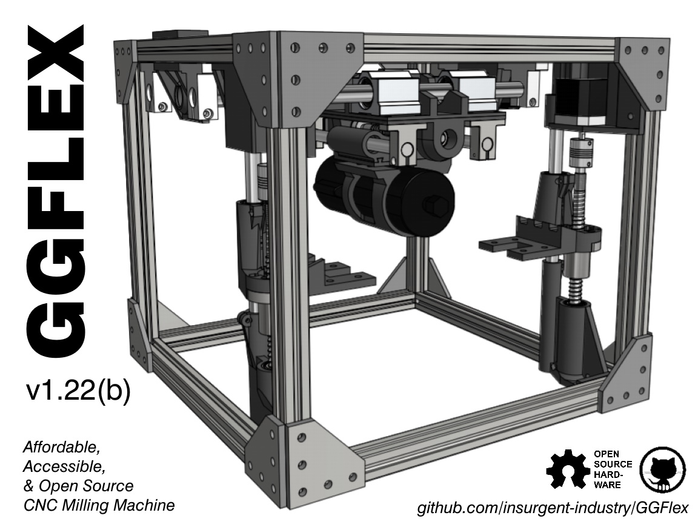

<i><b>The Ghost Gunner FLEX is a hardware clone of the Defense Distributed Ghost Gunner 2 with several variances designed to make the unit easily reproduced and manufactured by hobbyists. Just like the Ghost Gunner 2 that precedes it, the design of the FLEX is fully Open Source hardware. The FLEX is built from 3D printed parts, aluminum T-slot extrusion, and commonly available motion components all ubiquitous within the RepRap community.   
The FLEX features modular and swappable work-holding and accessory mounting methods, making it extremely flexible for a variety of tasks. The machine frame is suitable for use with conventional machining, fused deposition 3D printing, laser engraving, and grinding with straightforward toolhead swaps. The design is scaleable, allowing build envelopes up to 10x22x4 inches (250x550x100 millimeters) by a simple swap of motion and frame components without significant modifications to overall design. Having all square and flat features, the FLEX is also easily enclosed to control dust and temperature variations.   
The Ghost Gunner FLEX community is pursuing multiple development goals. Leveraging the project's modular design, different portions of our community are actively developing cheaper framing and build options using SAE hardware, full RepRap compliance (using the machine to manufacture the parts required to build more of itself), a 4th rotary axis for more complex parts manufacture, and a dedicated electronics and software suite... with much more to come! Beginning with the public project launch on Friday, October 9th 2020, we actively invite all interested parties to join us and help stretch the project's capabilities as we continue to grow!</b></i>
